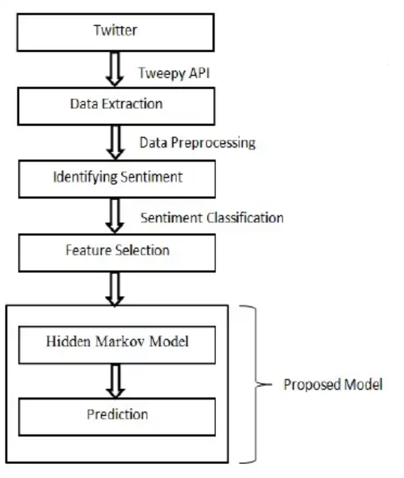
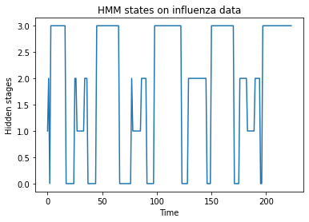
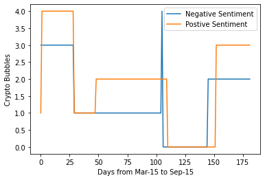
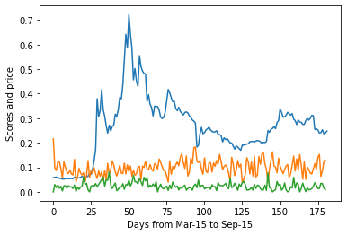

## Predicting DogeCoin Price Bubbles using Epidemic Modeling

## Meet the Authors

## Motivation 

Previously, researchers used only social media data as an indicator to predict cryptocurrency prices\cite{georgoula}, but the results proved insufficient to make the profits. The reason behind this is the volatility and price bubbles of the crypto market. There has also been some research on how cryptocurrency price bubbles have previously been linked with the epidemic-like spread of an investment idea \cite{shatland}. The idea is similar to how epidemic diseases spread when infected by a virus; a cryptocurrency market may boom or burst when infected with an investment idea. In predicting such epidemic diseases, especially influenza monitoring, researchers utilized Hidden Markov Model to detect the pandemic in an early stage \cite{bayesian}. 

The intuition behind this project is to study the application of previous works from epidemiology on different domains other than Epidemiology. This project aims to extend the idea of the hidden Markov model's usage in the early detection of Influenza disease to the cryptocurrency market. We chose the cryptocurrency market because there is a direct correlation as to how the price of a crypto market booms/bursts similar to an epidemic disease. The novelty of our idea is we want to show how previous research work of unique mathematical models in Epidemiology can easily extend to different domains. We also wish this project gives enough motivation to utilize the previous work done in epidemiology in various fields other than Epidemiology. A detailed approach and further practical details about the project are discussed in the next section. 

## Approach 

The crypto market is prone to sudden changes due to new investment ideas in the market. In order to best study this behaviour we attempted to predict doge coin price bubbles. As explained in the previous sections, crypto price bubble comprises of five phases in the following order: 
1. Displacement 
2. Boom 
3. Euphoria 
4. Profit 
5. Panic. 
To efficiently predict the doge coin bubbles, we need a model that detects boom, euphoria and panic phases in the market as early as possible. To achieve this we are extending the work of \cite{bayesian} in early detection of influenza pandemic to doge coin. We are using an HMM model that is previously been used on influenza data to successfully detect early stages of doge coin market.

As seen from the above image when an influenza time series data is trained on Hidden Markov model, the algorithm can successfully detect hidden states in between low-epidemic and high-epidemic states. Researchers used those hidden states to detect the disease even before happening. This similar approach of early detection of influenza is used in this project to detect early rise in the price of doge coin.
First, we tried to predict doge coin price bubbles using epidemic modelling, later we are tried to find the effect of influenza and covid data on the price of doge coin. 

## Relevant Links 
- Final Report 
- Final Presentation
- Software Files -

## Results

